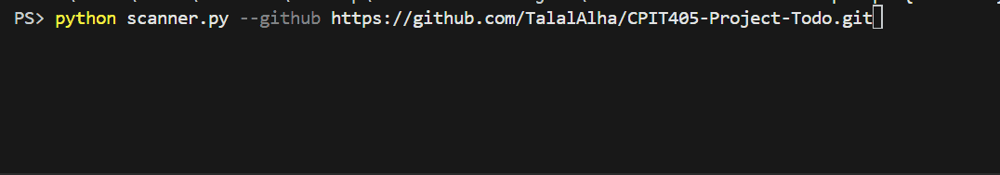

# 🔑 Secret Scanner — Modern Codebase Security Utility

[](https://python.org)
[](https://opensource.org/licenses/MIT)

**Secret Scanner** is a fast, automated command-line tool that helps developers and security researchers evaluate codebases for accidentally committed secrets, API keys, and credentials. It performs deep regular expression matching across local directories and remote GitHub repositories to identify sensitive information before it gets exploited.

## ✨ Features

- **Robust Pattern Matching:** Scans for AWS Access Keys, GitHub Tokens, Stripe Secret Keys, Google API Keys, Private RSA/SSH Keys, JWT Tokens, and hardcoded passwords.
- **Remote GitHub Scanning:** Direct integration with the GitHub API to scan public (or private) repositories recursively without having to clone them locally.
- **Smart Filtering:** Automatically ignores binary files and common non-code folders (`node_modules`, `.git`, `venv`).
- **Flexible Output:** Display results in the terminal with colored output, or export to JSON and beautifully styled HTML reports.
- **Redacted Previews:** Previews only the first 4 and last 4 characters of a secret to prevent further exposure in logs.

## 📸 Terminal Output Preview



```
Initializing Secret Scanner...
Scanning Local Path: ./my-project

--- Secret Scanner Results ---
[CRITICAL] AWS Access Key found in ./my-project/config/aws.py (Line 12)
    Secret: AKIA****************1234
[WARNING] Hardcoded Password found in ./my-project/db/settings.py (Line 4)
    Secret: pass****word

--- Scan Summary ---
Files Scanned: 45
Total Secrets Found: 2
Critical: 1
Warning: 1
Info: 0
```

## 💡 Why I Built This

I developed Secret Scanner as part of my continuous journey in cybersecurity and DevSecOps. After seeing numerous high-profile breaches caused by accidentally committed API keys and passwords, I wanted a lightweight, fast, and extendable utility to audit my own codebases.

Every regex pattern and scanning approach in this tool is based on real-world credential formats. I didn't just want to rely on existing tools — I wanted to understand the mechanics of secret detection, abstract syntax tree traversal, and API rate-limiting to help developers identify vulnerabilities before they reach production.

## 🚀 Quick Start

### Prerequisites
Make sure you have Python 3.7+ installed.

### Installation

1. Clone the repository and navigate to the directory:
   ```bash
   git clone https://github.com/TalalAlha/SecretScanner.git
   cd secret-scanner
   ```

2. Install dependencies:
   ```bash
   pip install -r requirements.txt
   ```

3. Run a local scan:
   ```bash
   python scanner.py --local /path/to/your/project
   ```

4. Run a remote GitHub scan:
   ```bash
   python scanner.py --github torvalds/linux
   ```
   *(To scan private repositories or increase your GitHub API rate limit to 5000 requests/hour, provide a GitHub Personal Access Token using the `--token` flag.)*

### Options

- `--exclude`: Comma-separated list of directories or files to ignore.
  ```bash
  python scanner.py --local . --exclude tests,mock_data.json
  ```

- `--full`: By default, the scanner skips standard test directories (like `tests/`, `e2e/`, `cypress/`) and standard test files (like `test_*.py`, `*.spec.js`) to prevent noise from mock credentials. Use this flag to perform a full scan of *everything* in the project.
  ```bash
  python scanner.py --local . --full
  ```

- `--output`: Choose the output format (`terminal`, `json`, `html`). Default is `terminal`.

> **Warning:** This tool is for ethical/educational use only. Please ensure you only scan repositories and directories that you own or have explicit permission to test. 

## 🛠 Tech Stack

- **Backend:** Python, `re`, `requests`
- **Reporting:** `colorama` (Terminal), `json`, `Jinja2` (HTML templates)
- **Architecture:** Modular scanning engine designed for easy extensibility (local vs. API-based scanning)

## 👨‍💻 Author

**Talal Alharbi**  
Cybersecurity Student, King Abdulaziz University  

🌐 **Portfolio:** [talalalharbi.com](https://talalalharbi.com)  
💻 **GitHub:** [github.com/TalalAlha](https://github.com/TalalAlha)
